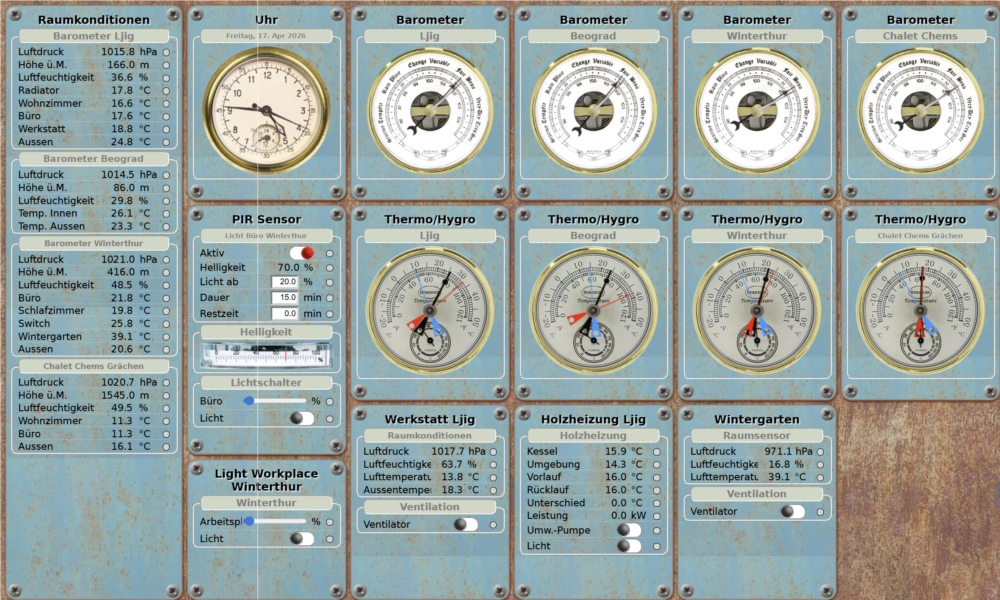

# things-server

A WebSocket-based server that connects **IoT devices** (ESP8266 nodes) with a **web browser** — accessible from anywhere in the world.

> **Example:** A sensor node measures room temperature. The value appears in real time on your browser — on your phone, tablet, and computer simultaneously. A switch on the control panel turns a lamp on or off. All connected browsers update instantly.

---

> **Example:** Several sensors and switches displayed as analog gauges on a display panel



---
## How it works

```
[ESP8266 Thing Node] <--WebSocket--> [things-server] <--WebSocket--> [Web Browser]
```

- **Thing nodes** (ESP8266 devices) register themselves on the server and publish their available services (sensors, switches, etc.)
- **Browser control panels** subscribe to the services they want to display
- The server routes messages between nodes and all subscribed panels in real time
- Multiple browsers can subscribe to the same service — all stay in sync

---

## Features

- Two-way communication: sensors send data *to* the browser; the browser sends commands *to* the devices
- Multiple thing nodes and multiple control panels can run simultaneously
- Each browser can configure its own collection of panels
- Supported panel types: value lists, switches, indicators, gauges, thermometers, barometers, hygrometers
- Works on Windows and Linux (tested on Raspberry Pi)
- Reachable from outside your home network via port forwarding / DynDNS

---

## Requirements

- [Node.js](https://nodejs.org/) (v12 or newer recommended)
- npm (comes with Node.js)
- A router with port forwarding if you want external access (optional)

---

## Quick Start

```bash
# 1. Clone the repository
git clone https://github.com/your-username/things-server.git
cd things-server

# 2. Install dependencies
npm install

# 3. Configure the server (port, optional mail settings)
#    Edit config.json in the main folder

# 4. Start the server
node thingsserver2
```

You should see:
```
thingsserver ready
```

Open a browser and go to `http://your-server-ip:PORT` to open the control panel.

---

## Configuration

Edit `config.json` in the main folder:

```json
{
  "port": 8081,
  "mail": {
    "host": "smtp.your-provider.com",
    "user": "your@email.com",
    "password": "yourpassword"
  }
}
```

| Key | Description |
|-----|-------------|
| `port` | Port the server listens on |
| `mail` | SMTP credentials for email notifications from thing nodes (optional) |

---

## Thing Nodes (ESP8266 / NodeMCU)

### Hardware

A recommended starting point is the **Wemos D1 mini** board, available from many online stores including AliExpress. You can use it directly on a solderless breadboard.

**Tip:** Wire a switch between pin **D3** and **GND**. Holding it during startup stops `init.lua` from executing — making it much easier to upload and modify code.

### Firmware

1. Build custom NodeMCU firmware at [nodemcu-build.com](https://nodemcu-build.com/) — select your required modules and download when the build arrives by email.
2. Flash the firmware using [NodeMCU PyFlasher](https://github.com/marcelstoer/nodemcu-pyflasher) (self-contained GUI, no Python install needed).

### LFS (Lua File Storage)

Using LFS is strongly recommended — it stores compiled Lua modules in flash memory, saving RAM.

Cross-compile your modules using the online service at [blog.ellisons.org.uk](https://blog.ellisons.org.uk/article/nodemcu/a-lua-cross-compile-web-service/) to generate an `lfs.img` file, then upload it to the device.

### Software Structure

| File / Folder | Purpose |
|---------------|---------|
| `init.lua` | Entry point, starts the system |
| `mConfig.lua` | Lists which sensor modules are active on this node |
| `mConfig_*.lua` | Example configuration files for certain modules, rename it to mConfig.lua to use|
| `mAplist.lua` | List of known routers |
| `transmit.lua` module | Handles server registration, sensor init, and message routing |
| `broker` | a text file which contains the server address and port in the format ip:port  or  hostname:port
| `Things/` folder | Available sensor modules (one file per sensor type) |

Each thing node connects to Wi-Fi using a list of known routers in **mAplist.lua** — no need to change credentials when moving the device between locations.

---

## Web Browser Control Panel

The things-server includes a built-in web server. Just open `http://your-server-ip:PORT` in a browser.

**Getting started:**
1. Open the small menu in the top corner
2. Go to **Settings**
3. Tick the panels you want to display

Panels are configured via JSON files in the `panels/` folder. One can configure a panel using the menu point "Panel Editor"

### Supported Panel Types

| Type | Description |
|------|-------------|
| Name/Value list | Simple text display of sensor values |
| Switch | Toggle a device on/off |
| Indicator | Show a status (on/off, alert, etc.) |
| Gauge | Needle-style measurement display |
| Thermometer | Temperature visualization |
| Barometer | Air pressure display |
| Hygrometer | Humidity display |

---

## External Access

To reach your things-server from outside your home network:

1. Set up **port forwarding** on your router to point to the server's IP and port
2. Optionally use a **DynDNS** service so you have a stable hostname instead of a changing IP address

---

## Project Structure

```
things-server/
├── thingsserver.js     # Main server file
├── config.json         # Server configuration
├── index.html          # Browser control panel entry point
├── panel.js            # Panel logic
├── ws.js               # WebSocket client for browser
├── ut.js               # Utility functions
├── panels/             # Panel configuration files (JSON)
└── Things/             # Lua sensor modules for ESP8266
```

---

## License

MIT — feel free to use, modify, and share.
